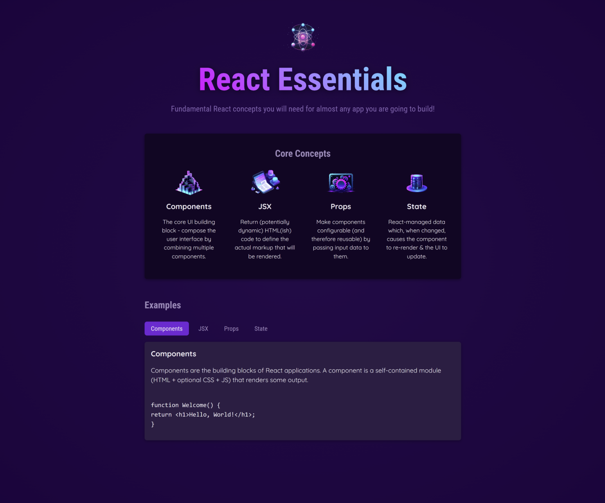

# Basic React app
This React application exhitbits the fundamental concepts such as components, props, hooks (useState).

This application was implemented following the online tutorial **React - The Complete Guide 2024** by **Maximilian Schwarzmüller**.

## Installation 
To run this app locally, clone the repository
- Install dependencies using the command:  ```npm install```
- Run the dev server using: ```npm run dev```

## Demo


**Click to view the app :** [Live Demo](https://react-essentials-nk.netlify.app/)

## Technologies used
- React 18.3.1
- JSX (JavaScript XML or JavaScript Extension)
- CSS
